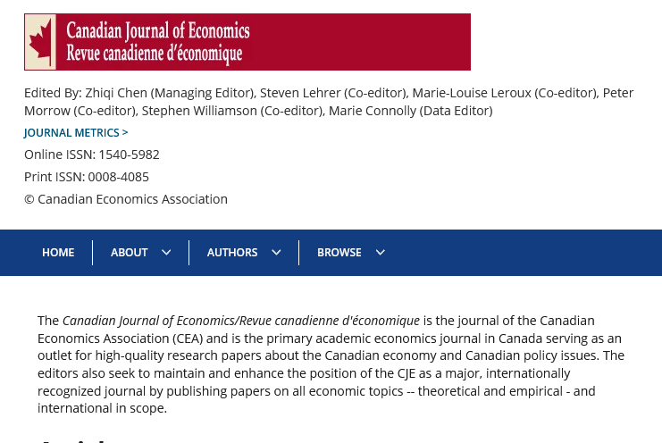
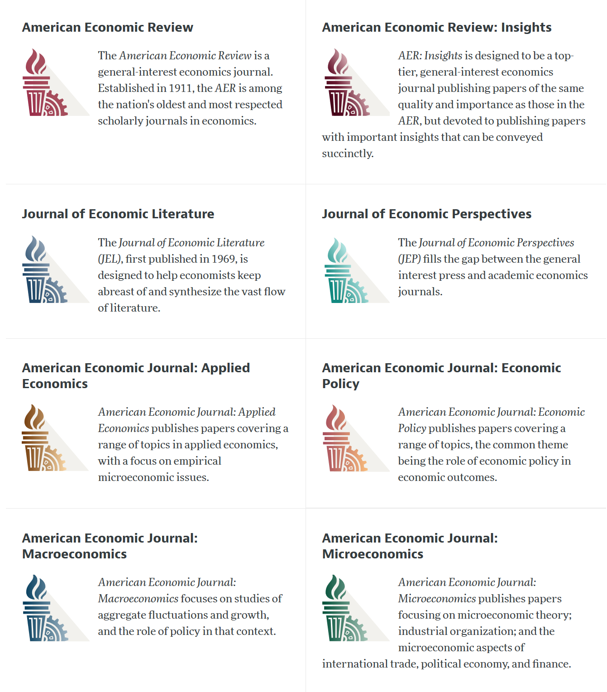

# Qui sommes nous?

## Marie Connolly

::::{.columns}
::: {.column width="50%"}

Vice-doyenne à la recherche de l'[École des sciences de la gestion](https://esg.uqam.ca/) et professeur titulaire, [Département des sciences économiques](https://economie.esg.uqam.ca/), UQAM
Université du Québec à Montréal;  directrice du [Groupe de recherche sur le capital humain (GRCH)](https://grch.esg.uqam.ca/), et "Data Editor" de la [Canadian Journal of Economics/Revue canadienne d'économique](https://www.economics.ca/cje-journal-content).

:::

::: {.column width="50%"}

:::

::::

## Lars Vilhuber

::::{.columns}
::: {.column width="50%"}

Executive Director of the [Labor Dynamics Institute](http://www.ilr.cornell.edu/ldi) and Senior Research Associate in the [Economics Department](http://economics.cornell.edu/) at [Cornell University](http://www.cornell.edu/), and the [American Economic Association](https://www.aeaweb.org/)’s Data Editor.

:::

::: {.column width="50%"}

:::

::::

## Data Editor of the AEA

::::{.columns}
::: {.column width="50%"}

2389 Manuscripts and 4440 Reports, approx. 4400 authors reached.

:::
::: {.column width="50%"}

:::
::::
