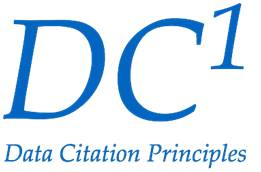

# Transparence : pourquoi ? {background-image="images/lake-red.jpg" background-size="contain" background-position="bottom"}

## Pourquoi la reproductibilité ?

::: {.incremental}
- Crédibilité
- Transparence 
- Efficacité du discours académique ?
:::

## Pourquoi la reproductibilité ?

:::: {.columns}

::: {.column width="50%"}

- Dans l'ancien temps... (20e siècle): données =  tableaux, code = formules, à la main

:::

::: {.column width="50%"}

:::
::::

## Pourquoi la reproductibilité ?

:::: {.columns}

::: {.column width="50%"}

- Les *données* sont devenues électroniques, n'étaient plus incluses ni citées
- Les formules ont été transcrites en **code**, et n'étaient plus incluses

:::

::: {.column width="50%"}

:::
::::

## Consensus croissant dans le monde académique

::: {.incremental}
- Principes "FAIR"
- Principes de *citation des données*
- *Reproductibilité* computationnelle
:::

## Principes FAIR

::::{.columns}

:::{.column width="50%"}

FAIR :

- **F**indable (*facile à trouver*)
- **A**ccessible
- **I**nteropérable
- **R**éutilisable

:::

:::{.column width="50%"}

:::

::::

## Principes de citation des données

::::{.columns}

:::{.column width="50%"}

:::

:::{.column width="50%"}

Pour le rendre **trouvable**,

[^dc]

[^dc]:  Data Citation Synthesis Group: Joint Declaration of Data Citation
Principles. Martone M. (ed.) San Diego CA: FORCE11; 2014
<https://www.force11.org/group/joint-declaration-data-citation-principles-final>

:::

::::

## Données et code aujourd'hui

 