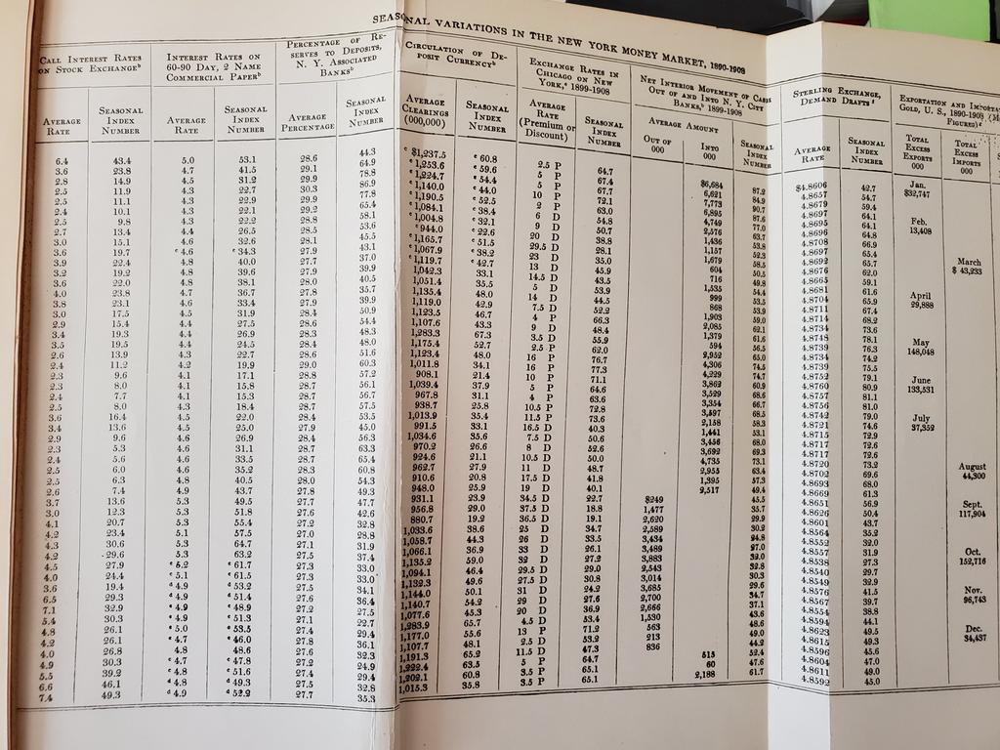
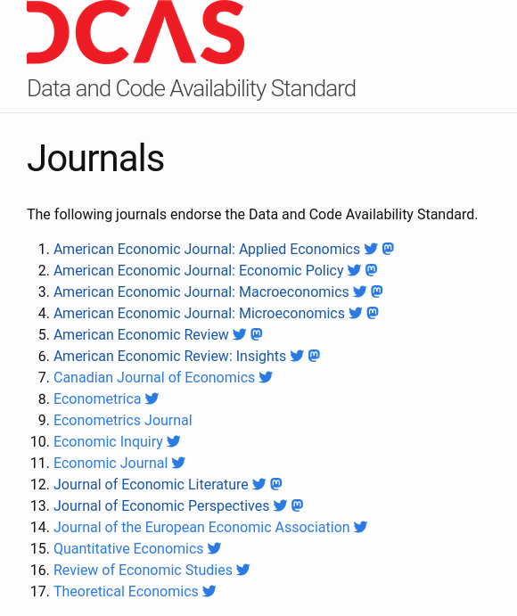
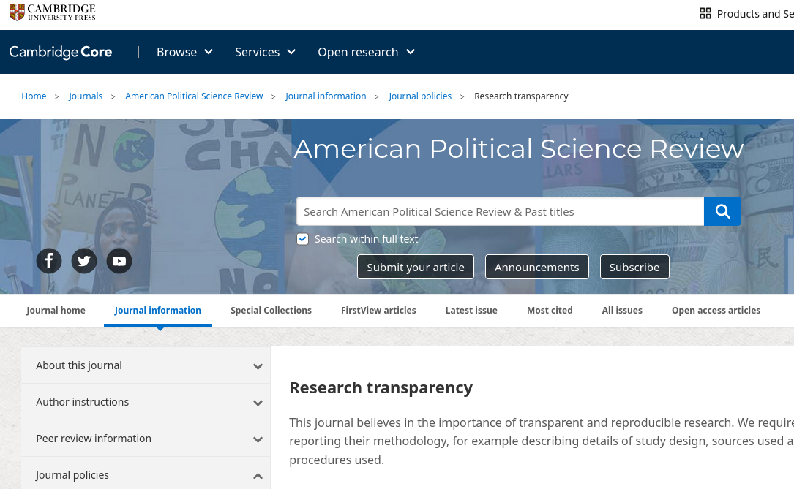
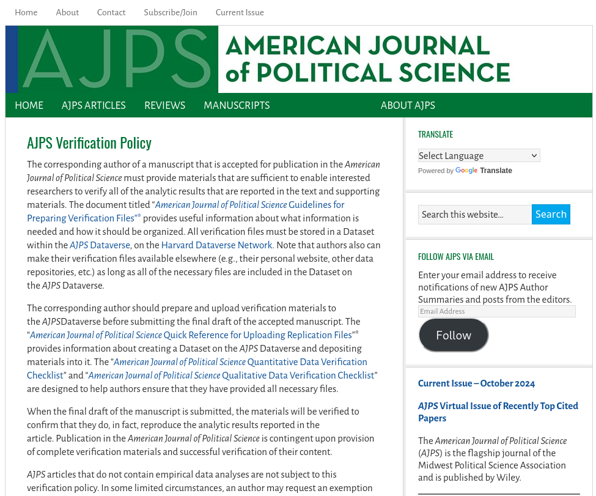
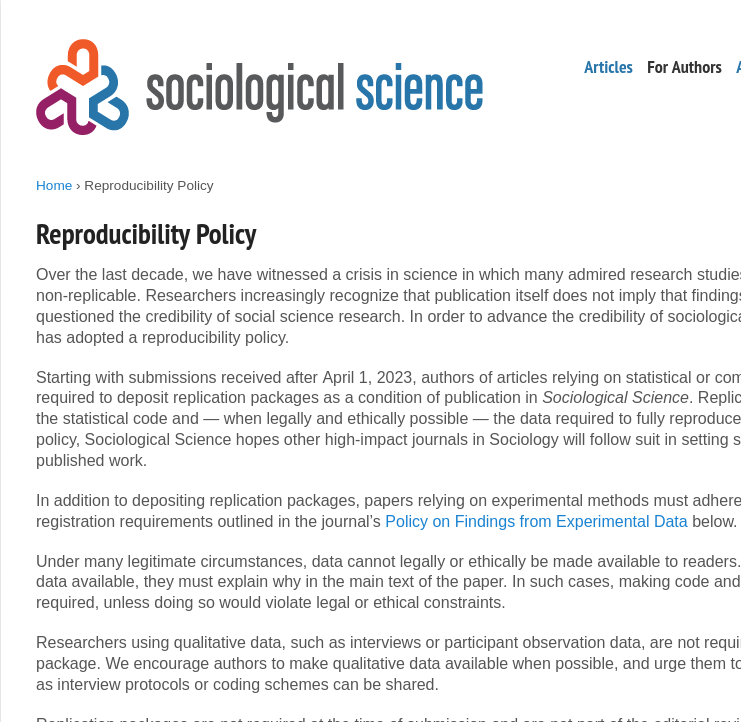
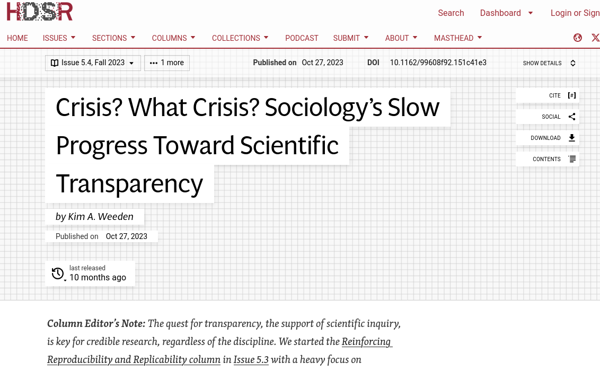

# C'est quoi, alors?

## Transparence

- Provenance des *données*
- Traitement des données, à partir des données **brutes** jusqu'aux *résultats* (code)

## Exhaustivité

- **Toutes** les données doivent être identifiées et leur accès décrit
- **Tout** le code doit être décrit et *fourni*
- **Tous** les matériaux  (formulaires et code source d'*enquête*, etc.) doivent être fournis

 
## Préservation

- Toutes les *données* doivent être préservées 
  - Idéalement, dans le "**replication package**", sous réserve des conditions d'utilisation
  - Sinon, dans un **dépôt de confiance** (trusted repository)

## Préservation

- Le *code* doit être dans un dépôt de confiance
  - Généralement, dans le "replication package"
  - Les sites web, Github, ne sont *pas acceptables*

## Plus complexe !

:::: {.columns}

:::{.column width="40%"}

:::
:::{.column width="60%"}

:::

::::

## Exceptions 

Aucune.

## ...

Ceci inclut les données confidentielles, administratives, privées, etc.

## ...

... il existe une zone grise :

- Quand les données n'appartiennent pas au chercheur (données de tiers), pas de contrôle sur la préservation, etc.
- Parfois, les *conditions d'utilisation* empêchent le chercheur de révéler les métadonnées (nom de l'entreprise, localisation)

## Transparence à nouveau

- Cependant : 
  - Aucune exception pour le besoin de **décrire** l'accès (le sien et celui des autres)
  - Aucune exception pour le besoin de **décrire** entièrement le traitement (possiblement avec du code caviardé)

# Reproductibilité en sciences économiques et au-delà

## {background-image="images/socsci-webpage.png" background-size="contain"}

## Data Editors {.smaller}

::::{.columns}

:::{.column width="50%"}

- [American Economic Association](https://www.aeaweb.org/journals/) (8)
- [Canadian Journal of Economics](https://www.economics.ca/cje-home) (1)
- [Review of Economic Studies](https://www.restud.com/) (1)
- [Royal Economic Society](https://res.org.uk/journals/) (2)
- [Econometric Society](https://www.econometricsociety.org/) (3)
- [Western Economic Association International](https://weai.org/view/EI-Journal-Policies) (1)
- [European Economic Association](http://www.eeassoc.org/journal) (1)
- [Journal of Political Economy](https://www.journals.uchicago.edu/journals/jpe) (bientôt)

:::

:::{.column width="50%"}

:::

::::

## Politiques communes {.smaller}

<https://social-science-data-editors.github.io/>

::::{.columns}

:::{.column width="50%"}

:::

:::{.column width="50%"}

:::

::::

## Ailleurs : Sciences politiques {.smaller}

::::{.columns}

:::{.column width="50%"}

:::

:::{.column width="50%"}

:::

::::

## Ailleurs : Sociologie {.smaller}

::::{.columns}

:::{.column width="50%"}

:::

:::{.column width="50%"}

:::

::::

## Mais pas uniforme !

## Ailleurs: Sociology {.smaller}

::::{.columns}

:::{.column width="50%"}

:::

:::{.column width="50%"}

 [^hdsr1]

[^hdsr1]:  Weeden, K. A. (2023). Crisis? What Crisis? Sociology’s Slow Progress Toward Scientific Transparency  . Harvard Data Science Review, 5(4). <https://doi.org/10.1162/99608f92.151c41e3>

:::

::::
